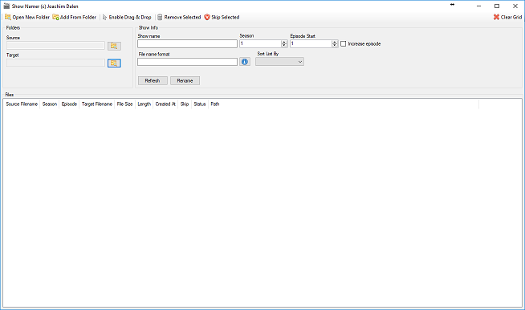

# ShowNamer

ShowNamer is a simple app to rename your TV Shows. It does not fetch information from any remote sources. 
Provide a show name and a specified format, and the app will rename series/episodes. 

Following is yet not implemented, but will come in the future.
- Moving files on rename
- Clear grid option on drag/drop

Icons credited to [FatCow](http://www.fatcow.com/free-icons)

## The following formats are added
| Key  | Value  | Example Format  | Result Example  |
|---|---|---|---|
|%sn|Show Name|%sn|	Show Name
|%s	|SeasonX	|%sn - %s|	Show Name - SeasonX
|%ss|SeasonXX|	%sn - %ss|	Show Name - Season0X
|%e	|EpisodeX	|%sn - %ss%e|	Show Name - SeasonXXEpisodeX
|%ee|EpisodeXX|	%sn - %ss%ee|	Show Name - SeasonXXEpisodeXX
|%S	|SX	|%sn - %S|	Show Name - SX
|%SS|SXX|%sn - %SS|	Show Name - SXX
|%E	|EX	|%sn - %SS%E|	Show Name - SXXEX
|%EE|EXX|%sn - %SS%EE|	Show Name - SXXEXX
|%xt|File Extension	|%sn - %SS%EE%xt|	Show Name - SXXEXX.mp4
---

